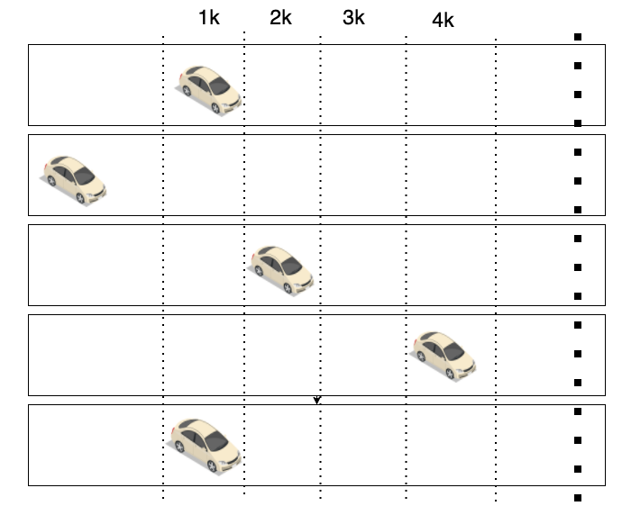
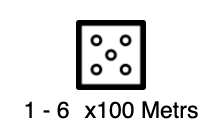
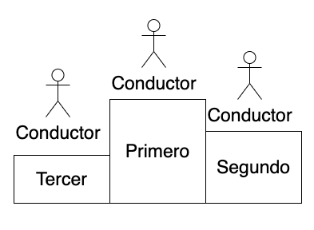
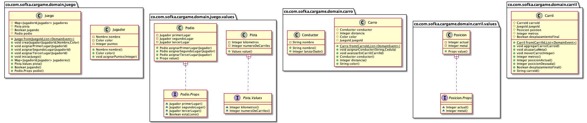

# CHALLENGE - JUEGO DE CARROS POR CONSOLA - JAVA #

## Summary ##

En este reto vamos a modelar un concurso de carros, donde vamos a tener ciertas reglas del juego. Para este reto es necesario tener los conocimientos básicos de Java usando el paradigma de programación orientada a objetos. Esto implica conocer de modelamiento de objetos, ademas se deberá guarda en base de datos los resultados del juego.

  

Dentro del reto se debe considera lo siguiente:

 *  Manejo de clases u objetos
 *  Persistencia de datos
 *  Manejos de listas o colecciones
 *  Conocimiento de Java 8
 *  Manejo de Git (versión de control)

Solo aplique al reto si te siente capaz de hacerlo.

¡Buena suerte!

## Use Case/Problem ##

Lo que se busca en este juego es crear unos carros y posicionarlo en una pista, puede existir tantos carros como pistas, cada pista deberá tener el mismo limite de distancia (kilómetros) para el recorrido del carro, los carros avanzan de forma aleatoria aumentado su distancia de metros (los kilómetros que deben convertir a metros para que el avance sea en metros), un ejemplo para una instantanea del recorrido:

  

Cada avance debe tirar un dado (de 1 a 6) que permita mover el auto y se debe multiplicar por 100, donde si se tira el dado y sacas 5, entonces debería ser aplicar 5\*100 = 500 (metros de recorridos):

  

  

Al final debe existir un podio donde se clasifique **primer**, **segundo** y **tercer** ganador:

Se concluye el juego y se guarda los valores. Luego se puede repetir para otro juego.

  

## Funcionalidades: ##

 *  Crear juego con jugadores, el juego debe tener los limites de kilómetros por cada pista (un jugador puede ser un conductor y un conductor debe tener un carro asociado y un carro debe estar asociado a un pista)
 *  Iniciar el juego, con un identificado se debe iniciar el juego, se debe tener la lista de carros en donde se pueda iterar y avanzar según la posición de la pista, esto debe ser de forma aleatoria.
 *  Se debe seleccionar primer, segundo y tercer lugar en la medida que los carros llegan a la meta (fin del recorrido), crear el objeto objeto podio.
 *  Se debe persistir los resultados con los nombres de los conductores y agregar un contador de las veces que ha ganado.

  

## Diagrama de clases: ##

  

## Evaluation criteria ##

| Criteria                                                             | Percentage |
| -------------------------------------------------------------------- | ---------- |
| Aplica los principios de programación orientada a objetos            | 30.0 %     |
| Realiza la persistencia de los resultados obtenidos de los ganadores | 31.0 %     |
| Utiliza un ORM para realizar la persistencia de datos                | 9.0 %      |
| Cumple con las funcionalidades descritas en el caso de uso           | 30.0 %     |

